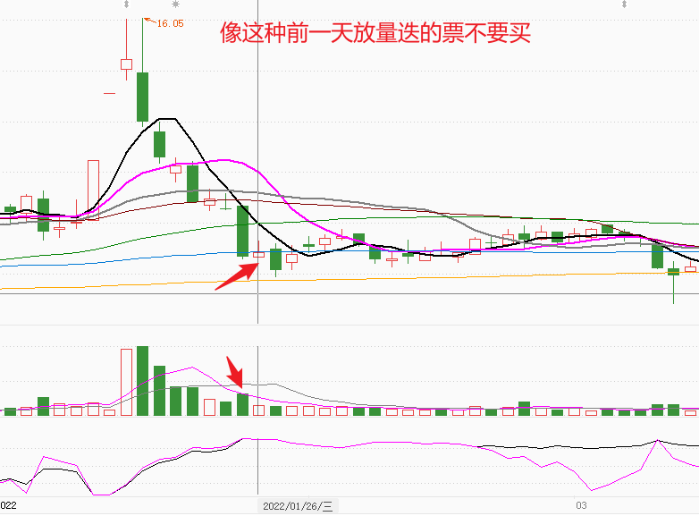

# 理论
就是一个套利的玩法，涨停说明有资金关注，下跌后一定会有个反弹，赚的就是反弹的几个点。
1. 当天的形态有几种情况
	- 已经企稳，明天要反弹
	- 下跌中继
	- 横盘震荡

# 买入形态
1.  涨停后缩量，

# 注意事项
## 1.量能一定是逐步缩减的
一定是涨停后的第一波缩量探底
## 2.上影线太长不能买

## 3.买点那天的量能最好不要超过前一天的

## 4.买点一定是第一次涨停（或者主升浪）之后的第一次缩量
**这个很重要，因为第二次涨停后的买点大部分都是坑**

## 5.涨停后处于高位震荡然后缩量的票不要买

## 6.缩量套利法的胜率不高，根据这个方法选出来的票一定要小心买

## 7.前一天放量跌的票不要买

## 8.大盘当天跌幅超过2个点就不要买了
