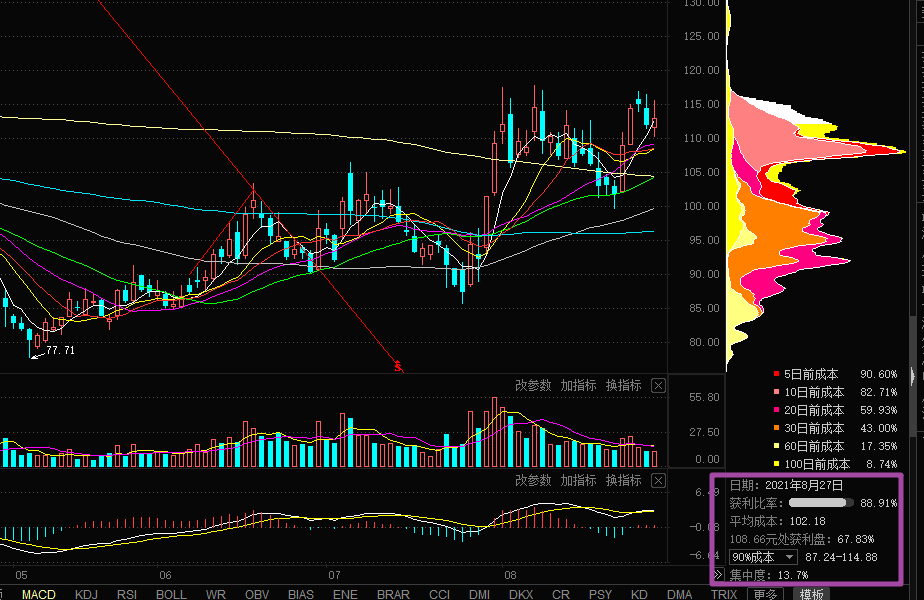
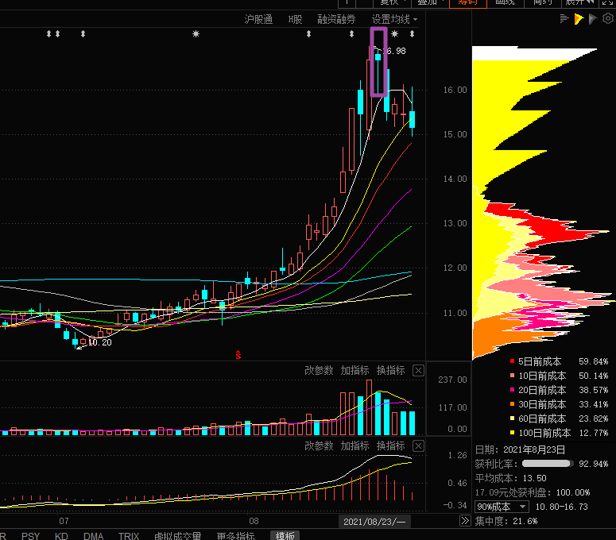
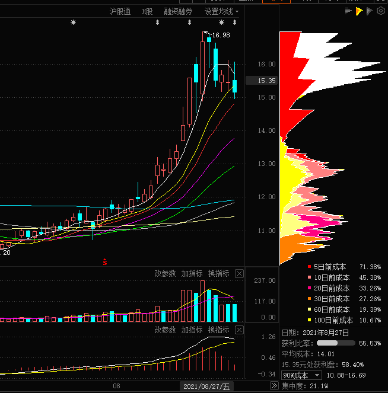
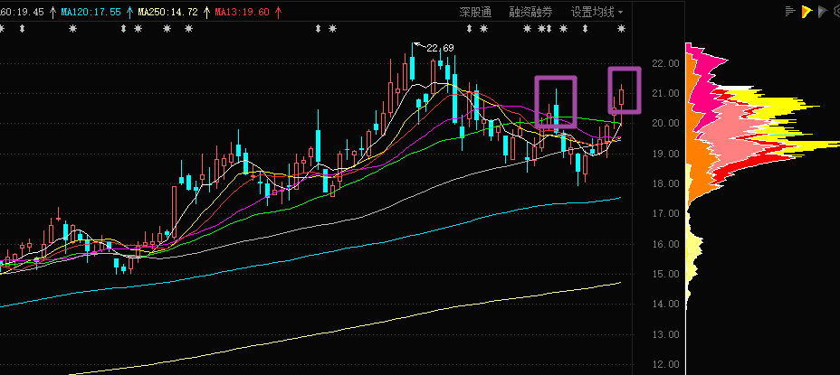
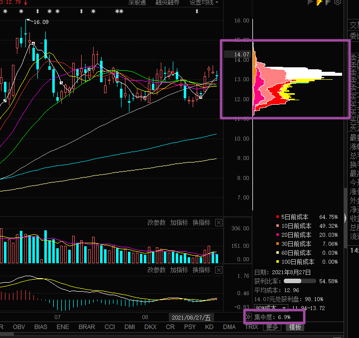
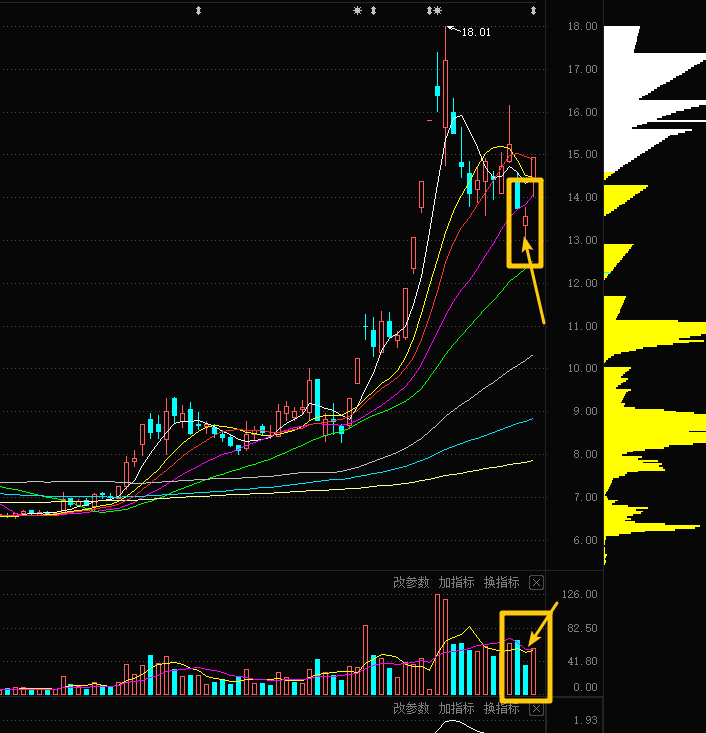
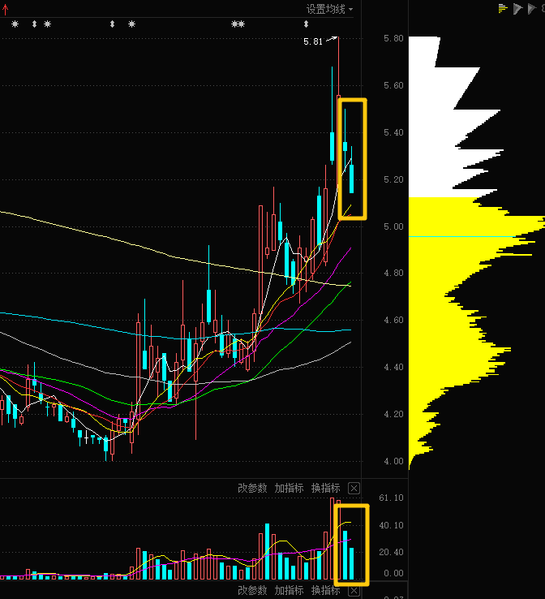
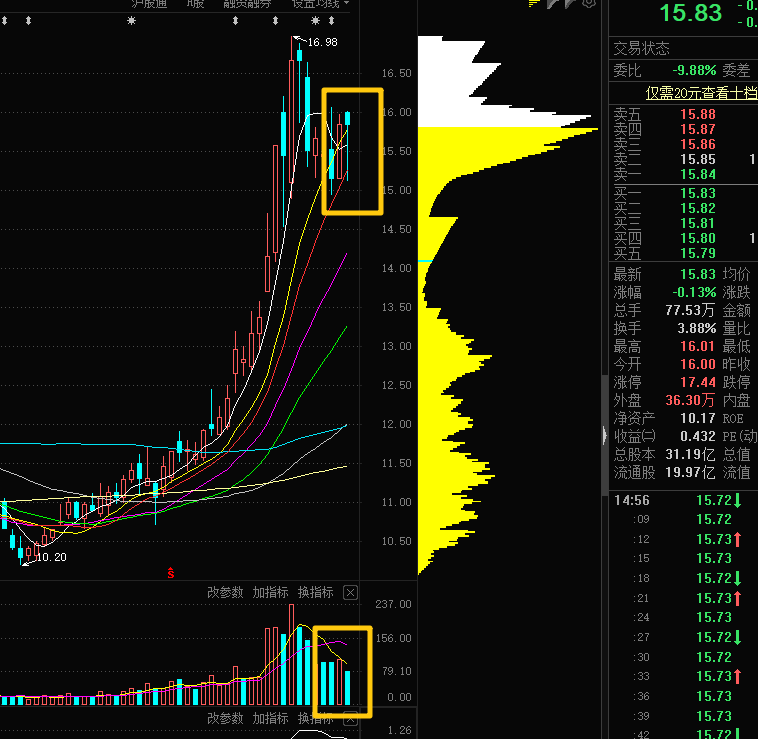

### 2021/08/29

#### 闻泰科技

看 K 线走势像是要杀多诱空洗盘，看筹码分布获利盘较多，或许短期不会有机会。

#### 东方电气

这是 8.23 号的筹码分布。

这是最新的筹码分布，可以看到低位的筹码有明显的松动。

##### 这个位置有两个判断：

1. 获利盘准备获利了结，有可能会震荡向下走势
2. 杀多诱空洗盘，主力想在这个位置再收集点筹码，再次上冲。

最新的筹码分布显示好多低位的筹码被换到了高处。

最后的几根绿柱都是缩量的。说明主力想让前期的获利盘出去一部分，于是下跌洗盘，但是又怕洗的太狠了，把趋势走坏了，吓跑散户，最终只能选择缩量下跌。

#### 鲁西化工

虽然看起来突破了前一波的颈线，但是看起来不够强势，看下明天会不会强势突破。

#### 露笑科技

看筹码这么集中，马上要爆发了。下周有回调就买。

下周等那种放量但是绿线的可以买。

## 2021/08/31

### 四方股份

前两天缩量调整，今天放量上攻，短线是个好机会。

明天看能不能弄点钱买入以下

### 新筑股份

缩量调整，必有新高。短线可以试试看

### 东方电气

缩量调整，前期涨的这么猛，这次调整过后，必有新高。

