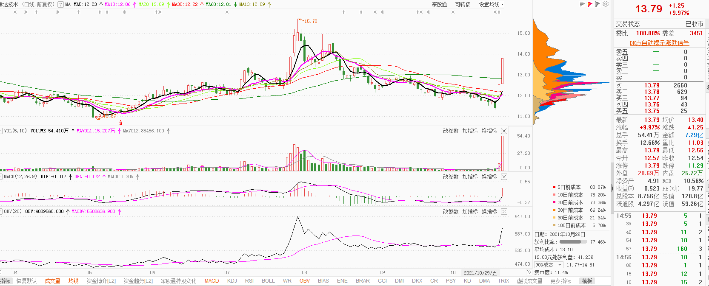

今天是星期六，把昨天放量的股票筛选了以下，挑出几个看好的，观察下以后的走势。

### 002815 崇达技术

前面放量拉了一波，又下跌之后拉了两个板，看筹码还没出货，可以搞

### 002576 通达动力

前面放量拉了一波，然后缩量回调后再拉，看好突破新高。

### 002057中钢天源

像前面一样，可能要走第二波。

### 603317 天味食品

经过长时间的调整，可能翻转在即，可以少仓位买入，等回调再买。

### 600556 天下秀

好像短线可以搞一下

### 600330 天通股份

查看筹码图，发现标注地方疯狂吸筹，可以短线搞一波

### 002130 沃尔核材

这个票前面放量拉了一波后，现在正处于回调整理中，等待机会出现，就是底部筹码变长，变长之后就可以买了。