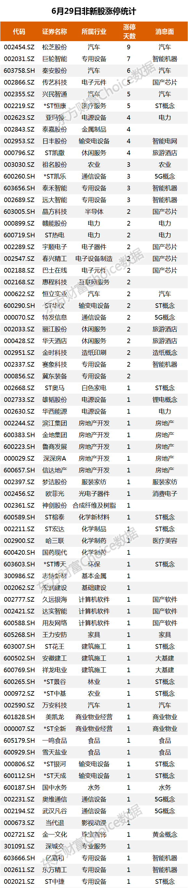

# 复盘
今天有`73`只涨停股，主要有下面几个板块
1. 汽车行业下面的芯片、电子元件
2. 专用设备下的机器人概念
3. 旅游
4. 基建、房地产
5. 电力相关

## 连板股票复盘
| 名称                              | 板数 | 板块                             | 形态     | 强弱     | 封单   | 涨停时间 | 备注                                                                                                                                       | 预期         | 实际                                     |
| --------------------------------- | ---- | -------------------------------- | -------- | -------- | ------ | -------- | ------------------------------------------------------------------------------------------------------------------------------------------ | ------------ | ---------------------------------------- |
| 松芝股份                          | 9    | 汽车热管理                       | YYYYYYYH | 换手强板 | 500万  | 13：48   | 一字开盘，盘中震荡到涨幅 7.5%，下午又重新封板，不过封单不多，明天肯定要走弱                                                                | 低开         | 跌停开盘，短暂翘板后又跌停               |
| 巨轮智能                          | 7    | 智能机器人                       | HHHHHYY  | 一字强   | 3.79亿 | 9：30    | 前几个板都是换手，分歧转一致后开始加速，不知道什么时候结束，封单挺多，明天可能还会板                                                       | 一字         | 微涨开盘，冲高后就开始震荡下跌，尾盘跌停 |
| 秦安股份                          | 6    | 汽车零部件                       | HYYYYH   | 弱板     | 540万  | 14：43   | 今天一字开盘就往下砸，最低负 5.89%，尾盘重新封板，明天低开就会走弱                                                                         | 低开         | 跌停开盘，短暂翘板后又跌停               |
| 传艺科技                          | 5    | PCB + 钠电池                     | HYYYY    | 一字强   | 2.5亿  | 9:30     | 四个一字板，龙虎榜不错，估计后面就是连续一字然后出货走弱                                                                                   | 高开         | 涨停开盘后，震荡后又重新封板             |
| 兴民智通                          | 5    | 汽车零部件 + 智能设备 + 无人驾驶 | HHHHH    | 强       | 1.2亿  | 10:23    | 全是换手板，今天换手率 19% 是最近最高的，还算健康，预期后面会走一字                                                                        | 一字         | 高开涨停，然后震荡向下尾盘又封板         |
| 亚玛顿                            | 4    | 光伏太阳能设备                   | YYYY     | 强       | 1.7亿  | 9:30     | 全是一字板，今天板上成交了`10`亿，板块内一枝独秀，走不远                                                                                   | 高开         | 迭 2 个点开盘震荡向下，尾盘跌停                                         |
| 泰嘉股份                          | 4    | 通用设备                         | HHHH     | 强       | 1600万 | 13:04    | 中间两个板都是开盘一字，然后震荡下重新封板，今天量能挺大，后面封住，属于分歧转一致，明天高开或一字                                         | 高开         |                                          |
| 日丰股份                          | 4    | 电缆 + 电网设备                  | HHHH     | 强       | 1.1亿  | 9:53     | 前两个板封板很快，所以量能不大，后面两个板量能都大一点，今天算是转一致了，                                                                 | 高开或一字   |                                          |
| 祖名股份                          | 3    | 农业 + 食品饮料                  | HHH      | 强       | 3300万 | 9:44     | 第二个板开盘一分钟就封板了，所以量能不大，就今天放量了，整个板块就两个涨停的，不是主流股。不过龙虎榜还可以，如果明天高开稳住，可以搞一下啊 | 高开         |                                          |
| 泰禾智能                          | 3    | 国产芯片 + 智能设备              | HHH      | 放量弱板 | 600万  | 13:16    | 今天几次被翘板，封单量也不多，明天低开                                                                                                     | 低开         |                                          |
| 远大智能                          | 3    | 智能机器                         | HHH      | 放量弱板 | 2600万 | 13:08    | 跟泰禾智能属于同板块，明天会超过。明天如果高开就买这个票                                                                                   | 高开         |                                          |
| 晶方科技                          | 2    | 汽车芯片 + 半导体                | HH       | 放量强板 | 1.4亿  | 10:23    | 今天放量了，换手率 16%，龙虎榜有上塘路和拉萨，看明天表现，高开震荡封板就可以打板                                                           | 高开         |                                          |
| 赣能股份                          | 2    | 电力 + 超超临界发电+火水         | HH       | 放量弱板 | 2990万 | 14:17    | 今天放量了，平开后震荡向下最低负 3.23%，尾盘封住了，明天如何能继续分歧然后重新封板的话就弱转强了。                                         | 低开         |                                          |
| 宇顺电子                          | 2    | 消费电子 + 光学电子显示器        | HH       | 放量弱板 | 1000万 | 14:48    | 今天放量了，尾盘有人翘板，然后又封住了。预期明天低开                                                                                       | 低开         |                                          |
| 春兴精工                          | 2    | 消费电子 + 汽车零部件            | HH       | 放量强板 | 4000万 | 9:52     | 今天高开 5%，然后震荡最低正 2.5%，封板也挺快。比宇顺电子强，看好二进三。                                                                   | 高开         |                                          |
| 巴士在线                          | 2    | 消费电子                         | YYDHH    | 放量弱板 | 220    | 13:44    | 明天肯定要走弱                                                                                                                             | 低开         |                                          |
| 惠程科技                          | 2    | 互联网服务+ 新能源、充电桩       | YY       | 放量强板 | 300万  | 9:30     | 板块内一枝独秀，估计会调整吧。                                                                                                             | 高开继续一字 |                                          |
| 恒立实业                          | 2    | 汽车零部件、汽车空调             | HH       | 放量强板 | 3700万 | 10:27    | 同属汽车零部件，看了前几天的走势，属于底部逐步放量。属于低位，后面高低切换时，会走出来。                                                   | 高开或一字   |                                          |
| 特发信息 | 2    | 5G概念 + 军工                    | HH       | 放量弱板 | 480万  | 14:45    | 前面突然放量涨停然后缩量回调了几天，最近又两连板， 今天封单不多，中途几次烂板。                                                            | 低开         |                                          |
| 丽江股份 | 2    | 旅游酒店                         | HDHY     | 一字强板 | 8900万 | 9：30    | 旅游概念，最近国家放松了疫情管控，可能会有一波，明天高开可操作。                                                                           | 高开或一字   |                                          |
| 华天酒店 | 2    | 旅游酒店                         | HH       | 放量弱板 | 600万  | 13:44    | 旅游概念，没有丽江股份强。                                                                                                                 | 低开         |                                          |
| 金时科技                          | 2    | 电容材料 + 造纸                  | HH       | 放量强板 | 1.2亿  | 9:33     | 走势很强，但是属于板块一枝独秀，不看好持续性                                                                                               | 高开         |                                          |
| 赛象科技                          | 2    | 汽车板块 + 专用设备              | HY       | 一字强板 | 8000万 | 9:30     | 第一个板2分钟就涨停了，今天是一字板，走势很强，封单也很多。                                                                                | 高开或一字   |                                          |
| 冀东装备 | 2    | 机械专用设备                     | HH       | 放量强板 | 120万  | 11:11    | 同属于专用设备板块，没有赛象科技强势。                                                                                                     | 高开         |                                          |

## 今日操作
1. 铭普光磁 `14.85` 卖出
2. 王府井 `25.62`卖出
3. 苏州固锝分 `3` 次买入
	- `16.04` 买入 `2800`
	- `14.92` 买入 `2200`
	- `14.75`买入`2100`

## 明日计划
1. 如果苏州固锝开盘低于 `5` 个点就卖出，因为今天放的量挺大的如果要走强肯定是高开，低开就弱了，就要卖出。
2.关注下赣能股份和远大智能、春兴精工、

# 今日新闻
1. 工信部：通信行程卡取消星号标记。利好旅游酒店
2. 六部门联合发布 ==工业能效提升== 顶层设计。规上企业要高效节能，推动==5G、云计算、边缘计算、物联网、大数据、人工智能==等数字技术在节能提效领域的研发应用。
	- 利好智能化制造
	- 特高压和配电网智能化

# 二连断板股票
| 名称     | 详情                                   |
| -------- | -------------------------------------- |
| 润贝航科 | 新股不参与                             |
| 摩恩电气 | 二连跌停，现在还在跌停板上，等缩量企稳的时候看看有没有搞头                       |
| 深赛格   | 迭了几天了，而且已经缩量了，感觉可以搞 |
# 涨停股
