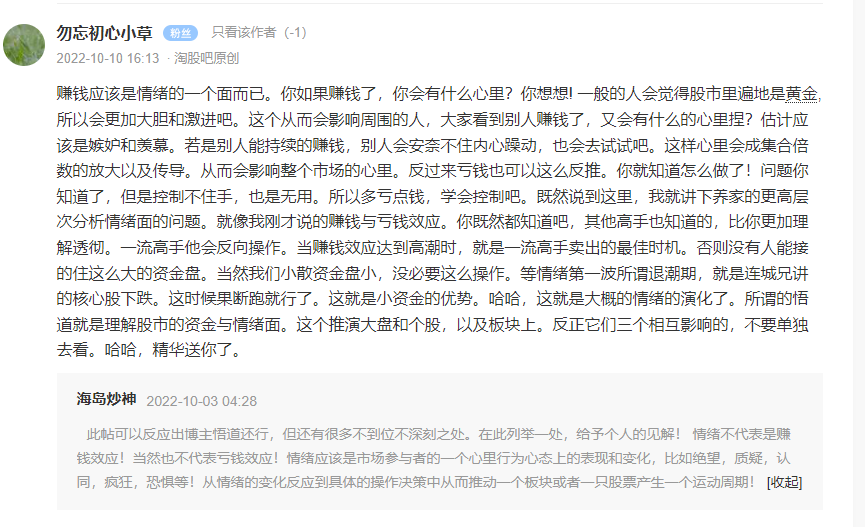

# 短线
## 短线核心
首先感谢大家对我的认可，思来想去将这一篇交易心得当做国庆节的一点小心意写给大家，因为是九月初写的，中途又略微修改，可能有些地方不通顺还请谅解，现在我就短线交易里的一些核心点给大家分享下自己的体会，主要包括模式、情绪周期、板块题材等，相信对于一些初入市场的朋友具备一定的启发意义  
  
先说模式，我之前提过很多人对于模式这两个字的理解是很片面的，多数人认为打板、低吸、半路这些就叫模式，不是的，这些是介入股票的姿势，是模式里很小的一部分，所谓模式，我个人理解需要包含以下四点：1、能够判断当下是什么环境，2、我适合或者应该在哪种环境下出手？3、我的出手点在什么地方？4、什么情况下或者说看到什么信号了我得卖出，而所谓打板、低吸仅仅是第3点中的一部分罢了  
  
判断当下的环境对于超短交易者来说是非常重要的，这直接决定了你的仓位高低和回撤控制能力，短线环境的分类其实早就被很多老师普及透了，主要分为混沌期（也可称为发酵期或者试错期）、主升期、退潮期，退潮期之后会再次进入混沌期，往复循环、亘古不变，当然有时候主升期之后会接一个高位横盘期，此所谓大级别周期，可以启动二波主升，三种环境中，混沌期持续的时间是最长的，主升期略长于退潮期，除了像22年这样的短线元年外大体都是这种规律，比如21年短线行情好的时候也就3月、7月下半月、11月下半月和12月罢了，满打满算差不多3个月，而其他时间要么没有环境要么就是混沌期，要么就是趋势流的行情，比如21年的5、6、8、9、10这五个月典型的就是新能源[锂电池](https://www.taoguba.com.cn/new/stockbar/other/barRedirect?type=1&&gnName=%E9%94%82%E7%94%B5%E6%B1%A0)的趋势行情，所以环境不好时候要学会空仓，或者说你趋势流玩的也不错，那你可以做模式切换，但我觉得大多数人应该没这能力，像我这样本身从趋势流转过来的选手现在再转回去也难免会不适应，因为趋势和超短本严格来讲就是相对立的模式，而像22年这样短线环境好的时候能有大半年左右的时间是很少的，所以大家不要误以为短线就该天天交易，天天有环境，这样的想法会加速自己的腰斩  
  
所谓混沌期其实非常好判别，混沌期的第一个特征是没有主线，也是最主要的特征，所谓没有主线也就是题材板块很容易隔日熄火，第二个特征是日内分歧转一致的票第二天闷杀，第三个特征是会走出莫名其妙的独立个股，也就大家说的[妖股](https://www.taoguba.com.cn/new/stockbar/other/barRedirect?type=1&&gnName=%E5%A6%96%E8%82%A1)或者庄股  
  
我想混沌期对于大家来说判断起来并不难，大家难的地方在于判断主升期的启动，既是主升，那必然会有一个票站出来打出高度，打出很好的赚钱效应，而主升期其实也就是启动在这个票确定市场地位的那个节点，举几个例子，1月28号的[保利联合](https://www.taoguba.com.cn/new/stockbar/barRedirect?stockName=%E4%BF%9D%E5%88%A9%E8%81%94%E5%90%88)3板扛住市场分歧确定个股辨识度，站在当时的角度你应该要有主升期即将启动的预判，为什么是预判而不是确定，因为我给过大家一个公式，情绪周期的启动=情绪打出拐点+优秀的板块+带动性的个股，个股有了还得有对应的板块来承载这一段周期，而当时如果只有保利联合而没有紧随其后的基建板块，那就没了周期，也就没了主升期，而保利联合也就只能当做一只妖股，而不是所谓的基建先锋龙头，所以主升期你可以去预判启动亦或是等明显的主升信号出现后再去参与也远远不迟，类似的还有4月27号的湖南大周期和5月18号的[中通客车](https://www.taoguba.com.cn/new/stockbar/barRedirect?stockName=%E4%B8%AD%E9%80%9A%E5%AE%A2%E8%BD%A6)大周期，仔细观察这3个周期，启动信号其实是非常明显的，而这个信号大多是龙头强更强或者分歧转一致的时候带动了板块爆发，甚至是带动了大盘走强，比如2月7号保利联合强更强的时候直接带动基建板块爆发，再比如4月28号[湖南发展](https://www.taoguba.com.cn/new/stockbar/barRedirect?stockName=%E6%B9%96%E5%8D%97%E5%8F%91%E5%B1%95)分歧转一致后带动了基建板块的二次爆发，再比如5月19号中通客车强更强的时候带动了新能源车板块的爆发，如果把连板高度想象成一个“V”形，那当右侧高度超过之前连板高度时，正常环境下也是一个佐证新周期启动的信号，多个信号叠加之下便提高了准确率，此所谓确定性  
  
最后是退潮期，退潮期也很容易辨别，这里我给大家一个极其明显且非常实用的信号：当一个周期中的核心票突然出现派发大面的时候，不要犹豫，做好减仓甚至是清仓的工作，当天出手也要非常小心，比如2月18号基建先锋龙头保利联合打出了跌停板宣布走A，此时主升龙[浙江建投](https://www.taoguba.com.cn/new/stockbar/barRedirect?stockName=%E6%B5%99%E6%B1%9F%E5%BB%BA%E6%8A%95)次日2月21号的涨停板成为了最佳出局点，你如果再侥幸一天，第二天迎接你的就是跌停，再比如4月12号[天保基建](https://www.taoguba.com.cn/new/stockbar/barRedirect?stockName=%E5%A4%A9%E4%BF%9D%E5%9F%BA%E5%BB%BA)尾盘直接砸出天地板，之后的两个礼拜进入了非常难操作的混沌期，当时有赚钱效应的只有[步步高](https://www.taoguba.com.cn/new/stockbar/barRedirect?stockName=%E6%AD%A5%E6%AD%A5%E9%AB%98)一只票，其余的票你一个不慎就是20个点的计提，而到了4月27号便重新进入了新的周期，所以总结起来就一句话，根据核心高标的巨幅亏钱效应预判退潮期，不要有任何侥幸的心理，因为亏钱效应会逐步扩散，就好比温水煮青蛙，水还没开的时候浑然不知，一旦水开了你想跑都跑不掉了，这句话和大家共勉  
  
如果你学会了判断环境，那接下来就得思考你应该在什么样的环境下出手？很明显，大多数人想要在这个市场里走出来，选择在主升期交易才是最合理的，但是刚才也说了，短线环境中主升期所占的时间是比较短的，所以在急功近利的心态驱使下，很多人是把控不住自己的，往往每天都会忍不住出手交易，而大多数交易都是发生在混沌期和退潮期的，所以在自身实力不足的情况下造成巨额亏损也就是情理之中的事情了，那混沌期就不能玩了吗？当然可以玩的，但是这里涉及到的就是我上面讲的一个问题，混沌期出手，那咱们的出手点在哪儿？我们可以发现即使在短线极难的9月份依旧有不少票是存在赚钱效应的，比如[中百集团](https://www.taoguba.com.cn/new/stockbar/barRedirect?stockName=%E4%B8%AD%E7%99%BE%E9%9B%86%E5%9B%A2)、[新华联](https://www.taoguba.com.cn/new/stockbar/barRedirect?stockName=%E6%96%B0%E5%8D%8E%E8%81%94)、[彩虹集团](https://www.taoguba.com.cn/new/stockbar/barRedirect?stockName=%E5%BD%A9%E8%99%B9%E9%9B%86%E5%9B%A2)等，仔细研究可以发现这些票具备的共同特征：强势、有舆论、高人气、股性好，而出手点在于中途的调整阶段，比如9月16号的中百、9月19号的新华联、9月23号的彩虹，都存在盈亏比较好的低吸位置，超强的人气会吸引大众的目光，良好的股性会促使博弈者蜂拥而至，但舒服的参与点也是转瞬即逝，错过了也就很难有好的位置进场，所以混沌期对于交易者的择时能力要求很高，大体在于多空双方的转势点，即空头宣泄殆尽、多头蓄势待发后的情绪载体，而这种载体标的具备预判性的带动意义，也就涉及到了选股  
  
择时之后才是选股，也就是到了出手的时间了，选股其实很简单，没有多数人想的那么复杂，无非就是以下几点：1、是否契合主流热点？2、是否具备加分项？（业绩、基本面、地域属性等）3、筹码结构，也就是k线形态是否大致整齐，4、股性好不好？近期是不是多阳少阴不坑人？5、个股预期是否足够大？（舆论发酵也是预期的一部分），即你认为他能有多少的故事可讲，能有多高的上升空间，他走出来的话是否具备示范意义？最后一点是占比最大的一个因子，每一个票的上涨都有原因，而上涨的原因就来自于预期，你要挖掘到这个预期，至于量能反而是占比较小的一个因子了  
  
而出手点一般在于第二天的强度确认或者当天的预判性出手，以第一点来讲，比如竞价结果是否符合预期，有没有被同梯队的卡位，有没有反卡的预期？而真正让你决定出手的点应该是超预期的，比如前一天的大烂板第二天居然大高开，那你的出手点就在于高开之后走下杀洗盘后的承接点，而如果直接选择冲高上板，那你的出手点应该在于判断上板的那一刻量是否足够了，够了就直接打板，不够就再等开板回封，这叫个股的出手点，除了这些你还得考虑当天的情绪高标是否符合预期，假设出现了我上面说的核心票出现不及预期的情况，那对于你昨天选出的个股你是否还要继续出手，是降仓位出手还是直接空仓？取决于你自己或者你的经验，个人而言就是我常说的买点后置，因为一旦高标的亏钱效应在当天就扩散开来，那早盘不管多硬的板下午都有可能砸到地板，比如8月12号的[科瑞技术](https://www.taoguba.com.cn/new/stockbar/barRedirect?stockName=%E7%A7%91%E7%91%9E%E6%8A%80%E6%9C%AF)，而当天[大港股份](https://www.taoguba.com.cn/new/stockbar/barRedirect?stockName=%E5%A4%A7%E6%B8%AF%E8%82%A1%E4%BB%BD)开盘就给出了较大的亏钱效应~  
  
很多人买入之后亏钱了，然后来问我为什么，我通常会说就是环境不好、情绪不好，没错啊，大多情况就这个原因，还有什么原因呢？8月12号的科瑞技术、[文一科技](https://www.taoguba.com.cn/new/stockbar/barRedirect?stockName=%E6%96%87%E4%B8%80%E7%A7%91%E6%8A%80)炸成那样你想一天也不会有其他多余的原因，情绪面来讲就是过于一致后造成的分歧踩踏  
  
介入之后才是考虑卖出的问题，卖就很简单了，第二天能继续上板是最舒服的情况，因为这样你在第三天有丰厚的利润垫和良好的心态来应对任何一种突发的跳水情况，因为无论如何你已经赚了，只要你不是在不及预期或者在有不确定性的情况下选择了加仓，那你这一笔交易已经成功一半了不是么？而假设第二天竞价就开始不及预期了，那个人惯是先出一半，另一半留下观察，经验来看这算是比较合理的应对策略，既防止了卖飞，又避免了判断出错导致巨幅亏损，有一句话叫会买的是徒弟，会卖的才是师傅，我觉得这句话适用于龙头，因为短线交易肯定不局限于龙头，而对于其余的票我认为会买的才是师傅，为什么呢？经常纠结于要不要卖的票往往只给予了你10个点以内的利润，这个时候你才会担心不卖就会被闷杀的问题，而如果一个票买进去很顺利的就给了你30个点的利润，那这个时候你反而不会担心来担心去，因为丰厚的利润垫给了你十足的底气，所以这是买点的问题，你选的好、买的好，自然拿的也很舒服，而这种情况大多发生在主升期  
  
以上就是我个人认为一种模式里该有的一些东西，不同的环境要采取不同的模式，以上是针对主升期的，而针对混沌期和退潮期自然也有对应的模式，大家口中经常说的切换其实大多时候是模式的切换，而不是个股的切换，个股只是因为模式的切换而切换了，是这样的吧？退潮期最好的模式是空仓，不要高估自己，也不要有任何的侥幸心理，这句话也和大家共勉，个人大体的模式其实挺简单的，混沌期积极试错，手法多样化，大体低吸、半路为主，主升期死磕核心个股，无脑怼，退潮期轻仓活口（或者高低切），试错时胆子要大一点，为什么？因为退潮结束进入混沌期后本身风险就已经释放到位了，这时候一旦出现符合大众审美的个股一定要敢上，你不上自有别人上，你抢一点筹码他抢一点筹码，所以你们可以发现大多数先锋龙都是加速走出来的  
  
说完模式再来说说情绪周期，这个我在上面大致已经讲完了，混沌期、主升期、退潮期的主要特征我想应该不用再做过多阐述，但是这里我再补充一些，所谓情绪周期是分为情绪和周期两个东西的，情绪很好理解，是市场的赚钱效应，周期是什么？周期是主流板块的启动与结束，两者合并才叫做情绪周期，有人要问了，赚钱效应好不就是主升期吗？不是的，这里我给大家往细了讲就明白了，混沌期有没有赚钱效应？当然有的，比如8月中旬的[国光电器](https://www.taoguba.com.cn/new/stockbar/barRedirect?stockName=%E5%9B%BD%E5%85%89%E7%94%B5%E5%99%A8)，当时是典型的混沌期吧？消费电子、芯片、风光储各自为战，那你能说当时是主升期吗？显然不是，这个时候的情绪是局部的，所以市场一定有情绪，但不一定有周期，真正的情绪主升期一定是一个或者两个主流板块承载着市场情绪往上走的，这才是赚钱效应最好的阶段，也是合力最强的阶段，大家可以回溯之前的任何一个赚钱效应好的阶段，无一不是这个特征，所谓总结规律也就是这样去做的  
  
最后是对于板块题材的选择判断，很多人经常看到一个消息就去意淫这个板块即将成为主流板块，这是很危险的，因为你站队站错了也就直接意味着你选股也是错的，可能这么说过于绝对，但是非主流题材的票肯定没有主流题材里的来的安全，而想要成为主流板块要符合三个特征：大、新、强，所谓大是级别大、范围大、想象空间大，比如18年的[5G](https://www.taoguba.com.cn/new/stockbar/other/barRedirect?type=1&&gnName=5G)，造就了大妖[东方通信](https://www.taoguba.com.cn/new/stockbar/barRedirect?stockName=%E4%B8%9C%E6%96%B9%E9%80%9A%E4%BF%A1)，比如19年的[网红](https://www.taoguba.com.cn/new/stockbar/other/barRedirect?type=1&&gnName=%E7%BD%91%E7%BA%A2)经济，造就了大妖[星期六](https://www.taoguba.com.cn/new/stockbar/barRedirect?stockName=%E6%98%9F%E6%9C%9F%E5%85%AD)，比如20年的[医美](https://www.taoguba.com.cn/new/stockbar/other/barRedirect?type=1&&gnName=%E5%8C%BB%E7%BE%8E)造就了大妖[朗姿股份](https://www.taoguba.com.cn/new/stockbar/barRedirect?stockName=%E6%9C%97%E5%A7%BF%E8%82%A1%E4%BB%BD)，再比如21年的疫Q造就了历史大妖[九安医疗](https://www.taoguba.com.cn/new/stockbar/barRedirect?stockName=%E4%B9%9D%E5%AE%89%E5%8C%BB%E7%96%97)，再比如今年的基建造就了大妖浙江建投，新能源车造就了大妖中通客车，这就叫级别大、范围大，级别分为省级、国家级、世界级，所谓新就是概念新，今年没有炒作过的、甚至是历史上没有出现过的东西，比如去年的疫Q，新的不能再新了，那是不是新的东西就一定能炒起来呢？不一定，新的东西出来如果没有对应的情绪加持也是起不来的，典型的比如前几天的卫星通讯，这叫生不逢时。所谓强就是盘面走势强，强一天不叫强，强两天才叫持续强，比如之前的卫星导航就不叫强，而[天然气](https://www.taoguba.com.cn/new/stockbar/other/barRedirect?type=1&&gnName=%E5%A4%A9%E7%84%B6%E6%B0%94)就叫强，因为人家强了好几天，而天然气是沾了欧洲能源危机的光，欧洲能源危机什么级别？世界级，新不新？当然新，但是我觉得逻辑不大正，所以实际上天然气持续了也没多久就结束了，什么样的程度才叫强呢？起码10个涨停以上，而九月初最强的是哪个板块？[一带一路](https://www.taoguba.com.cn/new/stockbar/other/barRedirect?type=1&&gnName=%E4%B8%80%E5%B8%A6%E4%B8%80%E8%B7%AF)对吧，新不新？新的，因为好久没炒过了，而且这次是咱们国家自一带一路政策以来首次出访开会，级别大不大？大的，背景更是世界级的争斗摩擦，盘面表现强不强？当然强了，所以他就是当时的主线板块  
  
以上大致就把短线交易的一些核心点阐述完了，讲的还是一些框架性的东西，但是我觉得对于大多数人应该还是有启发意义的，如果我分享一些细致的操作方法类的知识点可能大家更爱听，但是那些东西要基于你搭建完框架之后再循序渐进地揉进去，就好比造一栋大楼，你得先把地基、结构、长宽高都先打磨好才能去谈装修粉饰的东西，系统模式也是如此，框架足够牢固了才能承载更多的细枝末节的功能性东西，最后再次感谢大家的支持，希望这篇心得分享能够对大家有所帮助，最后祝大家国庆快乐，假期归来重新神采奕奕，梦想在上孤独在下，希望大家在交易上的一腔热忱最后都有所回报！

## 关于情绪

## 超短的几个步骤
今天来谈一下超短的核心东西。做交易的基本上都是理科，本人文笔不行，望海涵。个人认为如果想要做好交易的几个重要步骤；  
  
1.**情绪周期的把握**，这个情绪周期是超短选手必须掌握的核心东西，即赚钱效应，通过一些系统性质的数据，例如连板股，晋级情况，大面情况，等等一些数据，赚钱效应在哪里，是否有持续性，等等，这个就得靠自己去感受市场，冰点-试错-主升-高潮-退潮，这是常见的情绪周期，还有情绪周期的延续，例如这周三，伴随着[华银电力](https://www.taoguba.com.cn/new/stockbar/barRedirect?stockName=%E5%8D%8E%E9%93%B6%E7%94%B5%E5%8A%9B)的断板，周三情绪明显衰退，但是周四，伴随着，森特，长源秒板，[顺博合金](https://www.taoguba.com.cn/new/stockbar/barRedirect?stockName=%E9%A1%BA%E5%8D%9A%E5%90%88%E9%87%91)晋级成功，超短情绪继续延续，爆炸，等等。情绪周期有几种自己总结，  
2**.手法的凝练，**任何手法，都是建立在不同的情绪环境中才能运用的，一种手法，不能穿越所有的环境，所以你得手法就得看环境，处于情绪周期的什么位置，例如，试错期，做一进二，做对了就躺赢，主升期做连板股，高潮期，去弱留强，衰退期避免中位股，等等，主升期的龙PK手法，。这个也得靠自己总计，一个好的手法，无非胜率和赔率，胜率最少白分之75以上，如果胜率低，除非你的赔率特别大，才能稳定赚钱，这就是92科比的大道无形，什么手法运用在什么样的环境下，低吸，半路，反包，打板，连板，等等。  
3.**复盘能力**，这个复盘能力，必须有自己独有的一套复盘数据，高手复盘时间一般都是2个小时左右，很多人草草复盘一眼，这肯定是不行的，我说一下复盘的一些东西，核心数据，赚钱效应，指数，情绪，个股，最重要的是第二天的推演，交易计划，能出现几种情况，出现几种情况以后怎么处理，  
4.第二天早盘九点15到九点35之间的纠错能力，对于第二天的情绪推演，第二天竞价基本上就能知道，大概率开盘就能感受到，所以推演是推演，在早盘推演不到位的必须纠错。  
5.心态，这个心态，主要是看个人的管理，不具体说了，必须要不带感情色彩的理智交易  
6.感悟能力，这个是很重要的比较深层次的东西，就是反省，市场永远是对的，市场为什么这么选择？是随机的还是必然的，看清楚市场的本质，核心的东西。