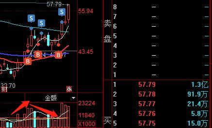
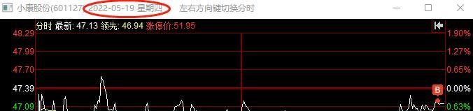
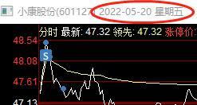
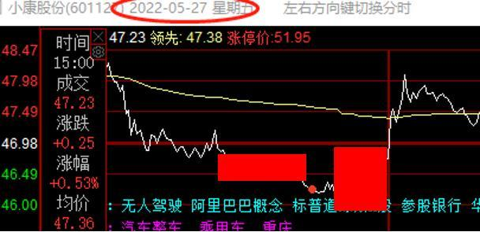

2022.6.2早盘:小康股份：95分的趋势股操作及如何做T

[天地同力2022](https://www.taoguba.com.cn/blog/6724235) 淘股吧原创  2022-06-02 07:41    |   浏览 25155   |   评论 550   |   加油 0/7   详情

因违反相关法律法规，该用户目前处于禁言状态

5.23早盘曾发文，《趋势势起》，此观点到现在不变，不少趋势好票都还在起涨点，好机会很多。整个6-8月份，趋势股都会有不错的行情。前面帖子讲短线居多，今天再把[小康股份](https://www.taoguba.com.cn/new/stockbar/barRedirect?stockName=%E5%B0%8F%E5%BA%B7%E8%82%A1%E4%BB%BD)拿出来，说说**趋势股如何操作**，顺带提一下**如何做T**。  
  

**一、操作环境**  
各位应该听过很多“老师”们讲如何操作趋势股了。记住：**凡是不分析环境的趋势股讲解，都是盲人摸象，都是马后炮**。做出来是运气，做不出来是常态！何为操作环境？  
  
1、判断**市场风格在切换**。  
每年基本都会有短线行情，也会有一段或长或短的趋势行情。当市场风格还没有切换到趋势的时候，做趋势的就只能天天看着隔壁做短线的挣钱，而自己的趋势票看死分析死也没用。  
  
远的不说，近的大家应该有印象。去年（2021）年上半年短线炒[碳中和](https://www.taoguba.com.cn/new/stockbar/other/barRedirect?type=1&&gnName=%E7%A2%B3%E4%B8%AD%E5%92%8C)，趋势就大炒过汽车，下半年炒消费。今年开年趋势比较颓，但是当下趋势已经起势。汽车、新能源等卷土重来。这种市场风格下做趋势股，胜率和赔率才会高！  
  
2、判断**主力资金大规模入场**。  
5.11，[长城汽车](https://www.taoguba.com.cn/new/stockbar/barRedirect?stockName=%E9%95%BF%E5%9F%8E%E6%B1%BD%E8%BD%A6)涨停，只有些敏感资金能关注到，这么大屁股能涨停，肯定不是散户干的。5.13再次涨停，这次更多人关注到了，但还是说一句牛逼就完事了，与自己有啥关系？  
  
其实在这之前的4.29、5.5[长安汽车](https://www.taoguba.com.cn/new/stockbar/barRedirect?stockName=%E9%95%BF%E5%AE%89%E6%B1%BD%E8%BD%A6)已经走出2连板，这就是市场最敏锐的一批资金干的。只不过那时候都在炒基建，没人关注到它。那时候你关注不到它也没关系，因为那里还属于鱼头和试错阶段。  
  
只是**5.13是[长城汽车](https://www.taoguba.com.cn/new/stockbar/barRedirect?stockName=%E9%95%BF%E5%9F%8E%E6%B1%BD%E8%BD%A6)、长安汽车、小康股份是同时涨停**的，这还反应不过来，就说明太迟钝了！一句话，**主力资金已经大规模进入汽车。**  
  
3、**消息/政策不断。**  
自主力大规模入场后，各种汽车的刺激消息就全来了。先是上海整车厂复工复产，然后汽车下乡，再然后购置税补贴。昨晚小康5月产销快报，增速大超预期。基本至少1-2个一字板了。  
  
这就是机构主力的研究优势和信息优势，小散是拼不过的。但是你完全可以扬长避短。  
  
**综上，小结一下：**  
**趋势股操作环境=市场风格切换+主力资金入场+消息/政策刺激。**三者缺一不可，市场风格都没切换，趋势根本就没人看；主力没入场，你要等到天荒地老，然后卖在起涨前；而不断的消息刺激，则是火上浇油，让趋势走的更远。  
  
这还是大局观！**趋势股的大局观**。做趋势股只看技术、形态，只是下层功夫。  
  
**二、操作过程**  
小康的操作，前面的帖子已经说了不少，有兴趣的可往前翻阅。只再简单说下：  
  
1、5.16。小康、长城、长安，3个涨停次日的票，只有小康是高开的，最强。且形态上是突破平台。故全天在均线吸筹建仓。  
  
2、5.17。最高触及涨停，减仓降成本。尾盘回落至6个点左右。因为算是炸板，且上方120日均线压制，接下来调整几天很正常。  
  
3、5.19。5日均线处支撑，全天水下继续吸筹。5.20。冲高3个点再次减仓降成本。  

其中一个账户。

5、5.27。**主力做最后洗盘**，又抢了不少筹码。5.30涨停继续减仓降成本。至此成本已经到了32以下，而筹码数量基本没变。后面就是躺着即可，不用再做T，等见顶信号出现出局即可。  

  
**小结：**  
（1）趋势票要精准介入，不浪费时间。**为何能精准介入？**就是前面说的3条趋势股的大局观。你们每次做趋势票是咋介入的？就是看见有大量、大阳线，觉得主力入场了？  
  
（2）介入后抓住机会做T降成本。把成本降到自己舒服的位置（我一般的惯是主力成本或波段低点之下）。不要有卖飞的想法，主动权比什么都重要。  
  
（3）不足：5.25早盘那个洗盘没买，那会在盘中解盘，错过了。所以95分吧。其余做T买卖点，实操中都是结合了每日盘势，题材强弱，主力意图的判断去操作的，没有那么简单！  
  
**三、关于做T**  
1、**判断主力入场点及成本价**。这是做T的基础。没有这个，你就不知道主力的底线在哪，操作中容易慌，容易被收拾。  
  
2、**判断题材及个股当日强弱**。做**趋势票不用看情绪？不用看竞价，不看风标？那是扯淡！**主力也不会逆势干，都会借势、顺势。整个题材都弱，你指望主力去拉？他更多时候会顺势调整，所以一般是做反T。题材、情绪好，一般是正T。洗套牢盘，正T，洗获利盘，反T，等等。  
  
3、**能看懂盘口**。这块是与主力搏斗的主战场，需要丰富经验。老司机自然有优势。  
  
**综上，总结：**  
1、趋势票做好也不容易，不要以为趋势票就是找一只“基本面不错”的，买进去躺着就可以了。要综合考虑操作环境，同时操作手法还要熟练。  
  
2、趋势票首次介入时点很重要。我的惯是一次就买够，甚至会多买。所以要看准，胜率要高。其次做T很重要，这也是无数人在讲也没说清楚的话题。做T本质是薅主力羊毛，你水平比不上别人，怎么去薅人羊毛？  
  
3、趋势与短线哪个容易？还是做好都不容易？哪个适合自己？可自行判断。  
  
以上。

1、怎么避免过早介⼊，买进去不涨的问题？  
答：对照“趋势=市场风格+主力资金+题材热度”的公式判断介入节点。  
2、怎么应对主⼒洗盘的问题？如何做T？  
答：确认趋势后不与主力做对手盘，跟随他，观察关键位置是套牢盘还是获利盘，套牢盘正T，获利盘反T。  
3、怎么拿得住票，吃到完整波段的问题？  
答：判断主力的入场点及成本价，将自己成本做到那之下之后，躺，直至见顶。

`20`日线上穿`60`日线是趋势股的一个很重要的节点。
买票必须要有逻辑，比如板块有异动，可以去板块里面找有所表现的个股。
