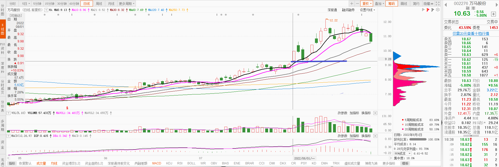
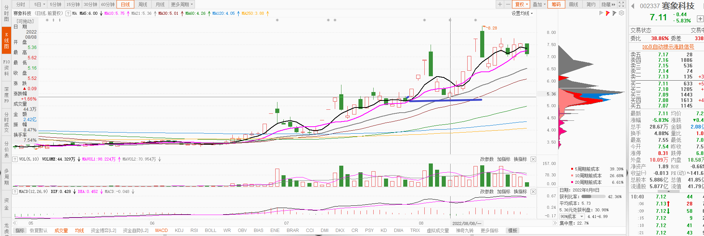
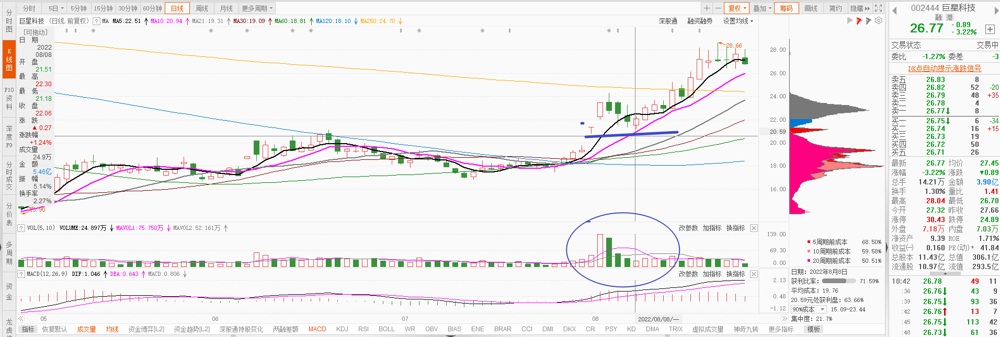

# 回调不破涨停那天的开盘价

# 放量涨停，然后缩量回调

像下面这种，放量涨停后，然后开始缩量下跌，很有可能就是在收集筹码。调整到位后，就开始拉升。

# 放量涨停后，次日平量微涨或微跌，第三天平量短红柱可买

# 跌倒一个平台附近可以低吸

# 放量涨停后，保持高位震荡并且没有缩量可以买

# 非连板票，涨停后回调拉红可以买

# 涨停后，高位横盘一段时间，然后下跌可以低吸
高位横盘是在收集筹码

