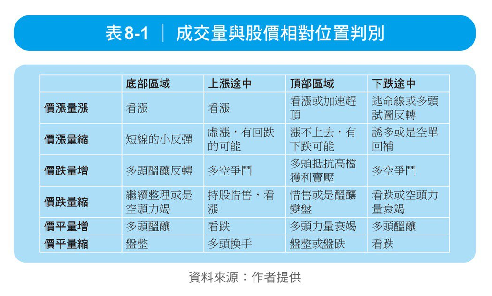
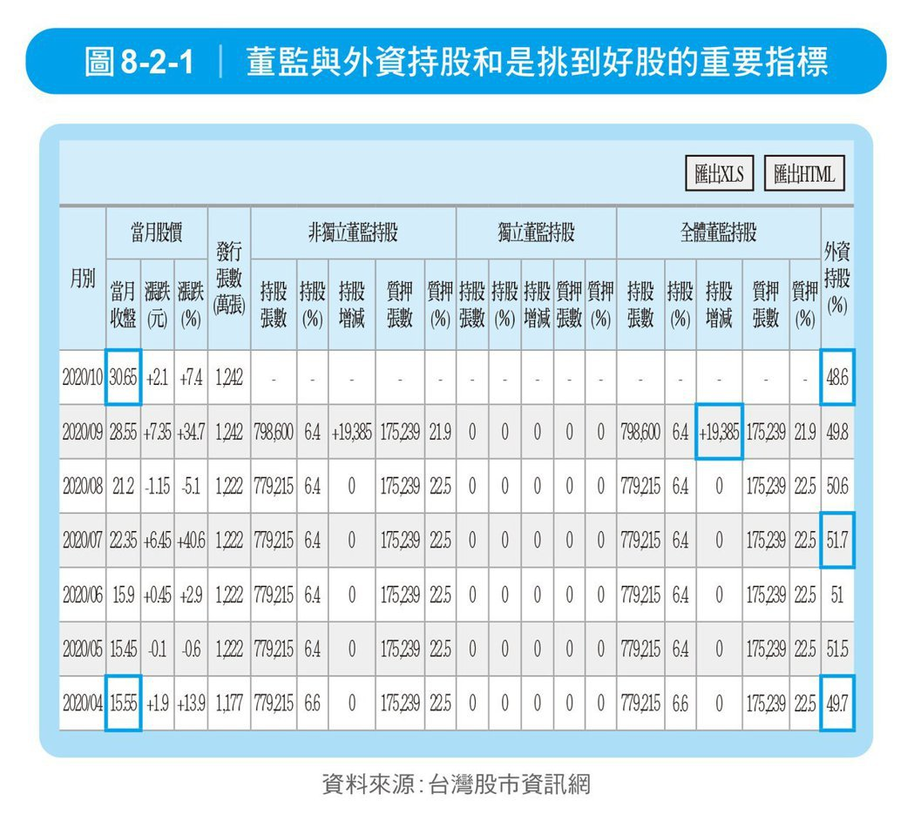
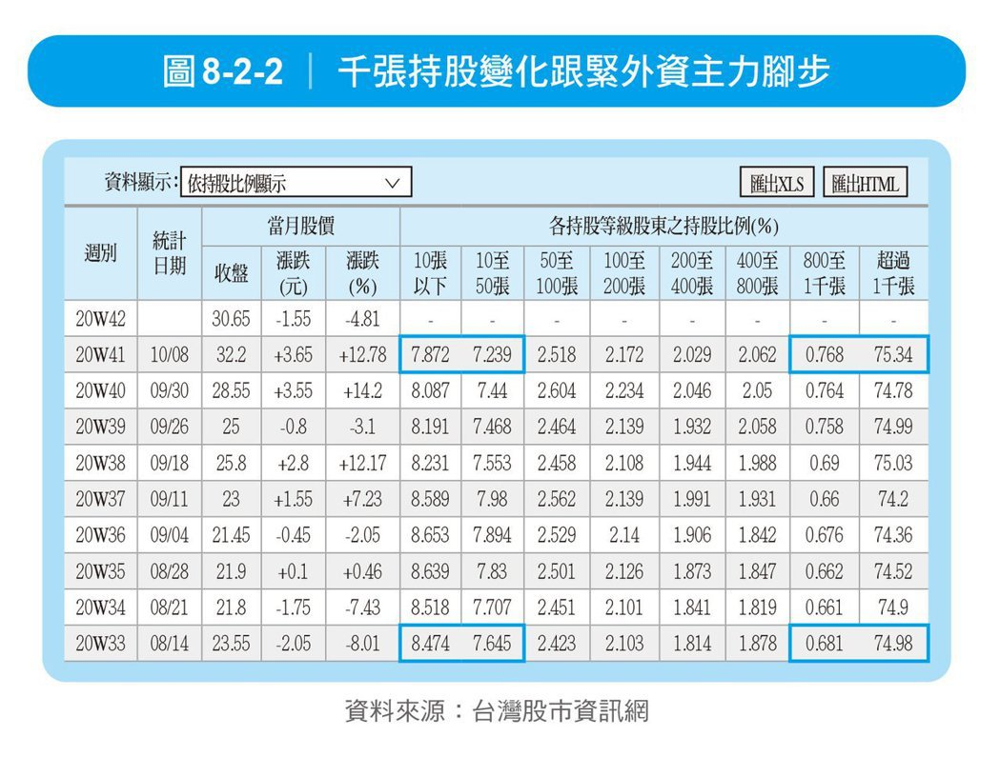

当成交量出现某些形态搭配 K 线组合时，可增加预测未来股价趋势与方向，因此，华尔街有句名言：股市里充斥着各式各样的骗子，只有 **`成交量`** 是唯一例外。

### 1.价涨量涨，买入信号

成交量持續增加，股價趨勢也轉為上升，這是短中線最佳的買入信號。「價漲量漲」是最常見的多頭主動進攻模式，应积极进场买入与主力共舞。

### 2. 价跌量缩，继续持有

成交量減少，股價仍在繼續上升，適宜繼續持股，即使籌碼被完全鎖定，也只能是小資金短線參與，因為股價已經有了相當的漲幅，接近上漲末期了。有時在上漲初期也會出現「價漲量縮」，但可能是曇花一現，經過補量後仍有上漲空間

### 3. 價跌量增，弃卖观望

股價經過長期大幅下跌之後，出現成交量增加，即使股價仍在下跌，也要慎重對待極度恐慌的「多殺多」情況產生。所以，此階段的操作原則是放棄賣出、空倉觀望。低價區的量增說明有資金接手，說明後期有望形成底部或反彈的產生，可以適時關注。有時若在趨勢逆轉跌勢的初期出現價跌量增，那麼更應果斷地清倉出局

### 4. 價跌量縮，賣出信號

成交量繼續減少，股價趨勢開始轉為下降，為賣出信號。此為無量下跌，底部遙遙無期。所謂「多頭不死、跌勢不止」，一直跌到多頭徹底喪失信心認賠殺出，爆出大的成交量時，跌勢才會停止。所以，在操作上，只要趨勢逆轉，應及時停損出場

### 5. 價平量增，轉多信號

股價經過持續下跌來到低檔區，出現成交量增加、股價回穩現象，此時，一般成交量的陽線明顯多於陰線，凸凹量差比較明顯，說明底部在積聚上漲動力，有主力在進貨為中線轉陽信號，可以適量買進持股待漲。有時也會在上升趨勢中途出現「價平量增」，則說明股價上漲暫時受挫，只要上升趨勢未破，一般整理後仍會有行情

### 6. 價平量縮，警戒信號

成交量顯著減少，股價經過長期大幅上漲之後，進行橫向整理不再上漲，此為警戒出貨的信號。此階段如果突發巨量拉出大陽或大陰線，無論有無利好利空消息，均應果斷出場

### 成交量与股价相对位置判别

**如何由籌碼的追蹤 發現即將上漲的潛力股**

俗話說：「新手看價、老手看量；真正的股市專家看的是『籌碼』。」學會算籌碼，就可搭上主力或外資的順風車，跟著賺取波段財。藉由簡單的籌碼運算，掌握股價關鍵的轉折反轉點。

如何從籌碼面分析去搶得股票即將上漲的最佳時機點，可藉由以下的操作步驟，您也可在高檔選到便宜又會漲的好股。

#### 1. 基本面及產業未來有發展的股票

投資者可利用當下環境，找出未來較有上漲可能的個股，例如疫情爆發時的防疫股票，疫苗研發成功時的跌深航空旅遊股票，或是國家政策支持的環保綠能風電或是半導體產業鏈，都是選擇好標的

#### 2. 董監及外資持股狀況

通常兩者相加應該維持在50-70%之間較為穩定，低於50%代表董監以及外資不是很認同公司發展的前景，高於70%以上則又像台積電一般，淪於外資掌控，股價不易出現大漲，但配股穩定就是。從外資持股變化也能洞悉該股未來能否有上漲的潛力，以下列半導體個股為例，在4月時，外資＋董監持股比例為56.3%，當時股價在15.55。

接著隨著外資不斷加碼，到了7月時，外資＋董監持股比例為58.1%，當時股價在22.35。隨著行情走高，外資逢高減碼，10月外資持股比例跌破49%，但董監在9月時有增加持股，這代表大股東看好加碼，所以綜合研判，短線該股長線看好，投資者可以等拉回或外資再度持續加碼時再進場。

#### 3.千張持股比例變化

從散戶及大戶是站在對立面而言，50張以下都算是散戶，而千張以上持股算是外資或是大股東，800-1000張之間算是中實戶。因此，如果50張以下的持股增加而千張持股減少，籌碼流向散戶行情易跌難漲。但如果相反，千張持股增加，50張以下持股減少，則籌碼由散戶向外資或大股東靠攏，行情易漲難跌。

如搭配行情走勢，則更容易清楚籌碼歸屬，通常千張持股比例低於40%，表示股票流向散戶；如果處於70%，則集中在大戶手中；高於80%以上，則又太過度集中，雖容易操控股價起跌，但不易出貨。最好的千張持股比例是40-70%，較易拉抬，超過70%，如果大股東看好產業後市發展，則有籌碼集中續漲的機會

