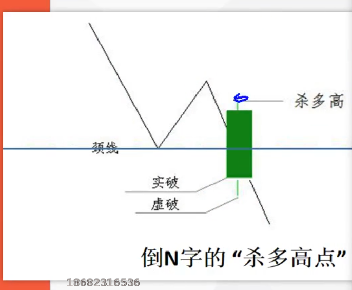
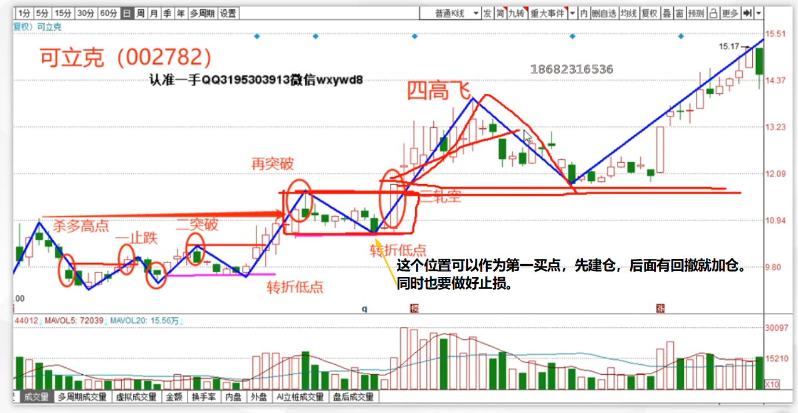

# 买入股票

## 强势股

股票由弱转强，也就是突破前波颈线后，出现轧空 K 线，可以作为第一买点，如果第二天出现回撤，也就是空头抵抗，可以作为第二买点。

**注意：如果后续两天跌破了轧空低点，说明主力是拉高出货。就要及时止损**

### 拉高出货

如果后续跌破了轧空低点，说明主力是拉高出货。就要及时止损

轧空低点会成为后期下跌趋势的支撑位

## 下跌趋势

下跌趋势只能看看能不能做波段

**杀多高点**

如果后续出现了一根杀多 K 线，后续并没有跌破

### 打压洗盘

如果后续突破了杀多高点，就说明之前主力的下杀是为了打压洗盘

杀多高点会成为以后突破的压力位

### 买票方法

## 注意事项

1. 建仓时，切记只能是小仓位，因为股票肯定是涨涨跌跌的。先用小仓位建仓，等回调再加仓。也会避免买错损失太大。、

## 买点

### 1. 下跌趋势的转折

​	

### 2. 上涨趋势的中继

